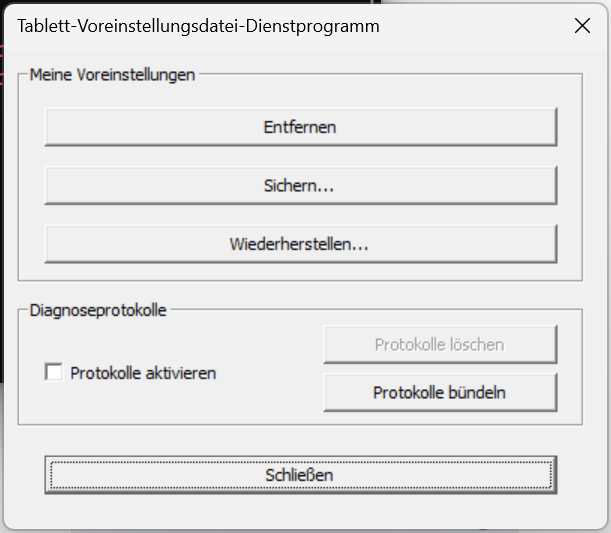

# Spike Discovery Log

- **Executed by:** [Simeon Weigel](simeon@sj4jc.de)
- **Date:** 2026 April 30
- **Test machine:**
  - Windows version:
    - `winver` - Windows 11 version 23H2 (Build 22631.6199)
    - `[System.Environment]::OSVersion.Version` output:
      - Major: 10
      - Minor: 0
      - Build: 22631
      - Revision: 0
  - Wacom driver version:
    - Wacom Tablet: 6.4.12-3
    - Wacom Technology - SoftwareComponent - 1.0.0.3
    - Wacom Technology - USBDevice - 1.0.0.3
- **Tablet:** Wacom One M

## 1. PrefUtil Binary

**Searched paths:**

- [x] C:\Program Files\Tablet\Wacom\PrefUtil.exe — exists: yes
- [x] C:\Program Files\Tablet\Wacom\Wacom_TabletUserPrefs.exe — exists: no
- [x] C:\Program Files (x86)\Tablet\Wacom\PrefUtil.exe — exists: no

**Actual path used:**

```path
C:\Program Files\Tablet\Wacom\PrefUtil.exe
```

**Help output:**

```sh
> $PREFUTIL_PATH = 'C:\Program Files\Tablet\Wacom\PrefUtil.exe'
> & $PREFUTIL_PATH /?
> & $PREFUTIL_PATH --help
> & $PREFUTIL_PATH -help
>
```

Opens a small window but no shell output.


Adding `/silent` disables the dialog but still gives no output to the command line.

**Import flag syntax confirmed:** /import - opens the same dialog as with --help
/silent is not implemented on /import

**Export flag syntax confirmed:** /export - opens an export dialog different from the above (also no /silent here)
and: specifying the destination file on command did not work for me. Instead only saving to default (some AppData subfolder) worked.
Even after the dialog showed the filepath I had specified in the command (i.e. "Saving to /path/to/wacom-lobo-adapter/spike/some.xml") no file did appear there.
Turns out the file extension needs to be .Export.wacomxs - then it works but I always have to approve in the dialog, no silent export possible.

[*Flag syntax specification*](https://developer-support.wacom.com/hc/en-us/articles/9354481821463-Run-the-Preferences-utility-from-the-command-line)

## 2. XML Mapping Element Discovery

**Diff result between baseline-A (full screen) and baseline-B (partial screen):**

Changed element name: `InputScreenAreaArray/ArrayElement`

Changed attributes (fill in actual names and values):

Base XML path:

- `root.TabletArray[0].ContextManager.MappingGroupArray[0].MappingSetArray[3].InputScreenAreaArray`
- `root/TabletArray/ArrayElement/ContextManager/MappingGroupArray/ArrayElement/MappingSetArray/ArrayElement/InputScreenAreaArray`

| Attribute                              | Value A (full screen) | Value B (bottom left corner) | Line |
|--------------- ------------------------|-----------------------|------------------------------|------|
| `InputArea.OverlapArea.Extent.X`       | 21600                 | 41472                        | 731  |
| `InputArea.OverlapArea.Extent.Y`       | 13500                 | 25137                        | 732  |
| `InputArea.OverlapArea.Origin.Y`       | 0                     | -11637                       | 737  |
| `ScreenArea.AreaType`                  | 0                     | 1                            | 757  |
| `ScreenArea.ScreenOutputArea.Extent.X` | 1920                  | 1000                         | 767  |
| `ScreenArea.ScreenOutputArea.Extent.Y` | 1080                  | 580                          | 768  |
| `ScreenArea.ScreenOutputArea.Origin.Y` | 0                     | 500                          | 773  |

These values are located under each `ArrayElement` in the `InputScreenAreaArray` (three elements in this case) block. The main difference is that the bottom-left mapping shifts the overlap origin and output origin to the right, and also switches the screen area from `AreaType=0` to `AreaType=1`.
While reducing mouse height/speed was also recorded in a previous test I think this is not in the minimal change set, as this Diff does not include it.

**Coordinate semantics:**

Origin/X;Y Extent/X;Y — for right half only X changes were made, Y was unaffected as the whole height of the screen was still projected.

**XML namespace on root element:** no namespace

**XPath expression to use in Set-WacomMapping.ps1:**

```txt
/TabletArray/ArraElement/ContextManager/MappingGroupArray/ArrayElement/MappingSetArray/ArrayELement/InputScreenAreaArray/
```

**Multiple tablet entries in XML:** no — single device

## 3. Wacom Service Names

```sh
> Get-Service *wacom* -ErrorAction SilentlyContinue | Select-Object Name, DisplayName, Status
> Get-Service *tablet* -ErrorAction SilentlyContinue | Select-Object Name, DisplayName, Status
Name              DisplayName                 Status
----              -----------                 ------
WtabletServicePro Wacom Professional Service Running
> Get-Service *wintab* -ErrorAction SilentlyContinue | Select-Object Name, DisplayName, Status
>
```

**Service(s) confirmed running:**

- WtabletServicePro — Wacom Professional Service — Status: Running

## 4. Admin Rights Test

**Export from non-elevated prompt:**

- Exit code: 0
- File created: yes, but only after user action (clicking "yes" on export dialog)
- Result: elevation not required

## 5. Coordinate System Notes

- **Region set via GUI:** bottom left corner of 1920×1080 = 0,500 to 1000,1080
- **Values found in baseline-B:** Extent.X=1000, Extent.Y=580, Origin.X (i.e. Left)=0, Origin.Y (i.e. Top) =500
- **Are coordinates in physical pixels or logical pixels?**
  - for `ScreenArea/ScreenOutputArea`: physical (match physical display res)
  - for `InputArea/OverlapArea`: logical (match DPI-scaled res) / unknown

## 6. Other Findings

As described above: the PrefUtil CLI is not pure CLI but requires user input to external window dialogs in most use cases.
